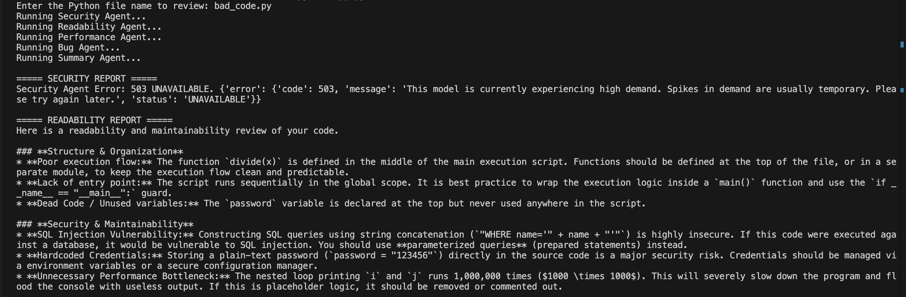

# AI Code Reviewer

A multi-agent code review system powered by Google Gemini.

## Features

- Security Agent
- Readability Agent
- Performance Agent
- Bug Detection Agent
- Summary Agent
- File-based code analysis

## How It Works

1. Read code from a Python file.
2. Send the code to specialized AI agents.
3. Generate:
   - Security report
   - Readability report
   - Performance report
   - Bug report
4. Combine all reports into a final summary.

## Technologies

- Python
- Google Gemini API
- python-dotenv

## Setup

Install dependencies:

pip install -r requirements.txt

Run the application:

python app.py

Create a .env file:

GEMINI_API_KEY=your_api_key_here

## Demo
Example run:


## Future Improvements
- Add support for reviewing multiple files
- Add code quality scoring
- Build a Streamlit web interface
- Export reports as PDF
- Support additional review agents


## Architecture
```text
Code File (test.py)

        |   
        v
   
       app.py
    (Coordinator)

        |
        v

    Specialized AI Agents
        |
        |--> Security Agent
        |--> Readability Agent
        |--> Performance Agent
        |--> Bug Detection Agent
        |
        v

    Summary Agent

        |
        v

    Final Code Review Report
